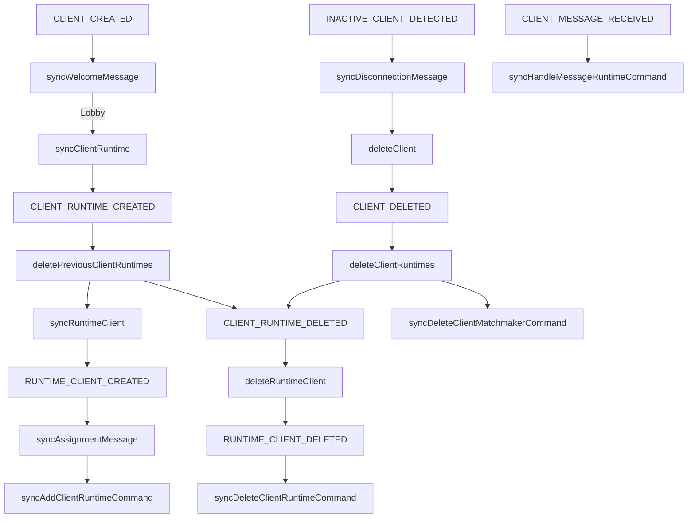

# Client Event Graph

```mermaid
graph TD;

CLIENT_CREATED --> syncWelcomeMessage
syncWelcomeMessage -- Lobby --> syncClientRuntime
syncClientRuntime --> CLIENT_RUNTIME_CREATED

CLIENT_RUNTIME_CREATED --> deletePreviousClientRuntimes
deletePreviousClientRuntimes --> syncRuntimeClient
deletePreviousClientRuntimes --> CLIENT_RUNTIME_DELETED

CLIENT_DELETED --> deleteClientRuntimes
deleteClientRuntimes --> CLIENT_RUNTIME_DELETED
deleteClientRuntimes --> syncDeleteClientMatchmakerCommand

CLIENT_RUNTIME_DELETED --> deleteRuntimeClient
deleteRuntimeClient --> RUNTIME_CLIENT_DELETED

RUNTIME_CLIENT_DELETED --> syncDeleteClientRuntimeCommand

syncRuntimeClient --> RUNTIME_CLIENT_CREATED

RUNTIME_CLIENT_CREATED --> syncAssignmentMessage
syncAssignmentMessage --> syncAddClientRuntimeCommand

INACTIVE_CLIENT_DETECTED --> syncDisconnectionMessage
syncDisconnectionMessage --> deleteClient
deleteClient --> CLIENT_DELETED

CLIENT_MESSAGE_RECEIVED --> syncHandleMessageRuntimeCommand

```

