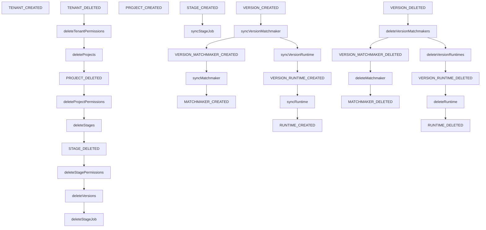

# Tenant Event Graph

```mermaid
graph TD;

TENANT_CREATED
TENANT_DELETED --> deleteTenantPermissions
deleteTenantPermissions --> deleteProjects
deleteProjects --> PROJECT_DELETED

PROJECT_CREATED
PROJECT_DELETED --> deleteProjectPermissions
deleteProjectPermissions --> deleteStages
deleteStages --> STAGE_DELETED

STAGE_CREATED --> syncStageJob
STAGE_DELETED --> deleteStagePermissions
deleteStagePermissions --> deleteVersions
deleteVersions --> deleteStageJob

VERSION_CREATED --> syncVersionMatchmaker
syncVersionMatchmaker --> VERSION_MATCHMAKER_CREATED
syncVersionMatchmaker --> syncVersionRuntime
syncVersionRuntime --> VERSION_RUNTIME_CREATED

VERSION_DELETED --> deleteVersionMatchmakers
deleteVersionMatchmakers --> VERSION_MATCHMAKER_DELETED
deleteVersionMatchmakers --> deleteVersionRuntimes
deleteVersionRuntimes --> VERSION_RUNTIME_DELETED

VERSION_MATCHMAKER_CREATED --> syncMatchmaker
syncMatchmaker --> MATCHMAKER_CREATED

VERSION_MATCHMAKER_DELETED --> deleteMatchmaker
deleteMatchmaker --> MATCHMAKER_DELETED

VERSION_RUNTIME_CREATED --> syncRuntime
syncRuntime --> RUNTIME_CREATED

VERSION_RUNTIME_DELETED --> deleteRuntime
deleteRuntime --> RUNTIME_DELETED

```

