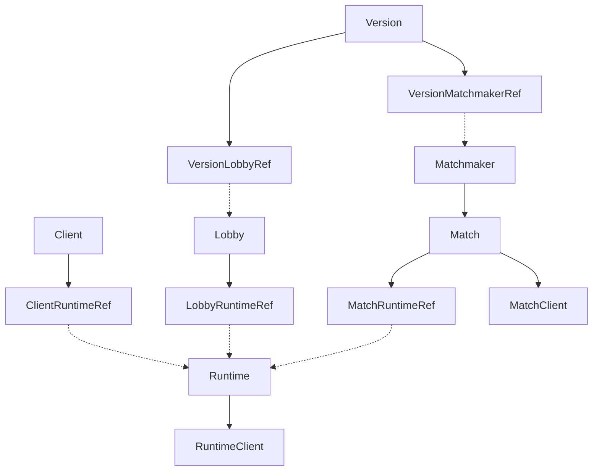

# Entity Relation Graph

```mermaid
graph TD;

Version --> VersionLobbyRef -.-> Lobby
Version --> VersionMatchmakerRef -.-> Matchmaker

Client --> ClientRuntimeRef -.-> Runtime

Lobby --> LobbyRuntimeRef -.-> Runtime
Matchmaker --> Match --> MatchRuntimeRef -.-> Runtime
Match --> MatchClient

Runtime --> RuntimeClient

```

