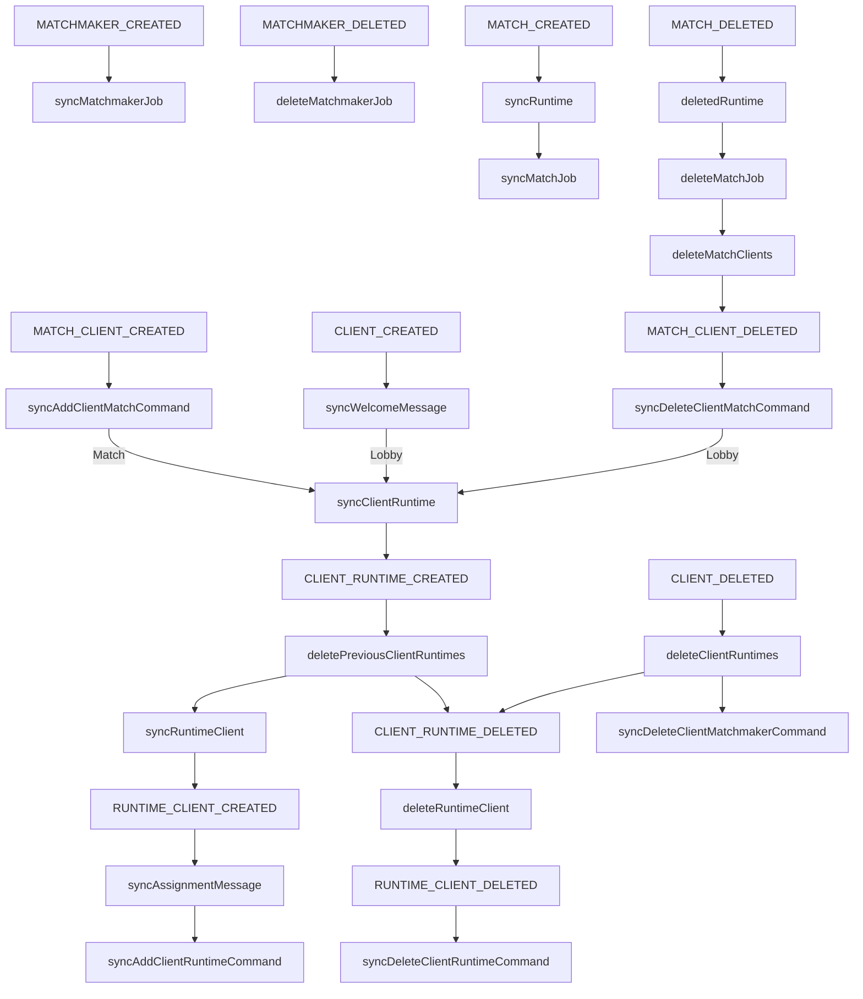

# Omgservers

```mermaid
graph TD;

MATCHMAKER_CREATED --> syncMatchmakerJob
MATCHMAKER_DELETED --> deleteMatchmakerJob

MATCH_CREATED --> syncRuntime
syncRuntime --> syncMatchJob

MATCH_CLIENT_CREATED --> syncAddClientMatchCommand
syncAddClientMatchCommand -- Match --> syncClientRuntime

CLIENT_CREATED --> syncWelcomeMessage
syncWelcomeMessage -- Lobby --> syncClientRuntime
syncClientRuntime --> CLIENT_RUNTIME_CREATED
CLIENT_RUNTIME_CREATED --> deletePreviousClientRuntimes
deletePreviousClientRuntimes --> syncRuntimeClient
deletePreviousClientRuntimes --> CLIENT_RUNTIME_DELETED
syncRuntimeClient --> RUNTIME_CLIENT_CREATED
RUNTIME_CLIENT_CREATED --> syncAssignmentMessage
syncAssignmentMessage --> syncAddClientRuntimeCommand

MATCH_DELETED --> deletedRuntime
deletedRuntime --> deleteMatchJob
deleteMatchJob --> deleteMatchClients
deleteMatchClients --> MATCH_CLIENT_DELETED
MATCH_CLIENT_DELETED --> syncDeleteClientMatchCommand
syncDeleteClientMatchCommand -- Lobby --> syncClientRuntime

CLIENT_DELETED --> deleteClientRuntimes
deleteClientRuntimes --> CLIENT_RUNTIME_DELETED
deleteClientRuntimes --> syncDeleteClientMatchmakerCommand
CLIENT_RUNTIME_DELETED --> deleteRuntimeClient
deleteRuntimeClient --> RUNTIME_CLIENT_DELETED
RUNTIME_CLIENT_DELETED --> syncDeleteClientRuntimeCommand


```

