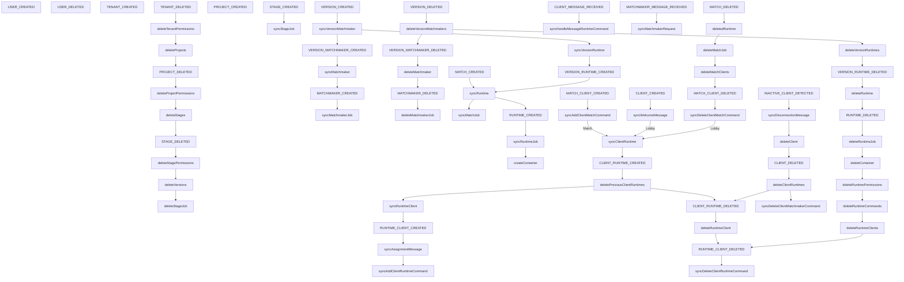

# Omgservers

```mermaid
graph TD;

USER_CREATED
USER_DELETED

TENANT_CREATED
TENANT_DELETED --> deleteTenantPermissions
deleteTenantPermissions --> deleteProjects
deleteProjects --> PROJECT_DELETED

PROJECT_CREATED
PROJECT_DELETED --> deleteProjectPermissions
deleteProjectPermissions --> deleteStages
deleteStages --> STAGE_DELETED

STAGE_CREATED --> syncStageJob
STAGE_DELETED --> deleteStagePermissions
deleteStagePermissions --> deleteVersions
deleteVersions --> deleteStageJob

VERSION_CREATED --> syncVersionMatchmaker
syncVersionMatchmaker --> VERSION_MATCHMAKER_CREATED
syncVersionMatchmaker --> syncVersionRuntime
syncVersionRuntime --> VERSION_RUNTIME_CREATED

MATCHMAKER_CREATED --> syncMatchmakerJob
MATCHMAKER_DELETED --> deleteMatchmakerJob

MATCH_CREATED --> syncRuntime
syncRuntime --> syncMatchJob

RUNTIME_CREATED --> syncRuntimeJob
syncRuntimeJob --> createContainer

MATCH_CLIENT_CREATED --> syncAddClientMatchCommand
syncAddClientMatchCommand -- Match --> syncClientRuntime

CLIENT_CREATED --> syncWelcomeMessage
syncWelcomeMessage -- Lobby --> syncClientRuntime
syncClientRuntime --> CLIENT_RUNTIME_CREATED
CLIENT_RUNTIME_CREATED --> deletePreviousClientRuntimes
deletePreviousClientRuntimes --> syncRuntimeClient
deletePreviousClientRuntimes --> CLIENT_RUNTIME_DELETED
syncRuntimeClient --> RUNTIME_CLIENT_CREATED
RUNTIME_CLIENT_CREATED --> syncAssignmentMessage
syncAssignmentMessage --> syncAddClientRuntimeCommand

MATCH_DELETED --> deletedRuntime
deletedRuntime --> deleteMatchJob
deleteMatchJob --> deleteMatchClients
deleteMatchClients --> MATCH_CLIENT_DELETED
MATCH_CLIENT_DELETED --> syncDeleteClientMatchCommand
syncDeleteClientMatchCommand -- Lobby --> syncClientRuntime

CLIENT_DELETED --> deleteClientRuntimes
deleteClientRuntimes --> CLIENT_RUNTIME_DELETED
deleteClientRuntimes --> syncDeleteClientMatchmakerCommand
CLIENT_RUNTIME_DELETED --> deleteRuntimeClient
deleteRuntimeClient --> RUNTIME_CLIENT_DELETED
RUNTIME_CLIENT_DELETED --> syncDeleteClientRuntimeCommand

RUNTIME_DELETED --> deleteRuntimeJob
deleteRuntimeJob --> deleteContainer
deleteContainer --> deleteRuntimePermissions
deleteRuntimePermissions --> deleteRuntimeCommands
deleteRuntimeCommands --> deleteRuntimeClients
deleteRuntimeClients --> RUNTIME_CLIENT_DELETED

INACTIVE_CLIENT_DETECTED --> syncDisconnectionMessage
syncDisconnectionMessage --> deleteClient
deleteClient --> CLIENT_DELETED

CLIENT_MESSAGE_RECEIVED --> syncHandleMessageRuntimeCommand

MATCHMAKER_MESSAGE_RECEIVED --> syncMatchmakerRequest

VERSION_MATCHMAKER_CREATED --> syncMatchmaker
syncMatchmaker --> MATCHMAKER_CREATED

VERSION_MATCHMAKER_DELETED --> deleteMatchmaker
deleteMatchmaker --> MATCHMAKER_DELETED

VERSION_RUNTIME_CREATED --> syncRuntime
syncRuntime --> RUNTIME_CREATED

VERSION_DELETED --> deleteVersionMatchmakers
deleteVersionMatchmakers --> VERSION_MATCHMAKER_DELETED
deleteVersionMatchmakers --> deleteVersionRuntimes
deleteVersionRuntimes --> VERSION_RUNTIME_DELETED

VERSION_RUNTIME_DELETED --> deleteRuntime
deleteRuntime --> RUNTIME_DELETED

```

