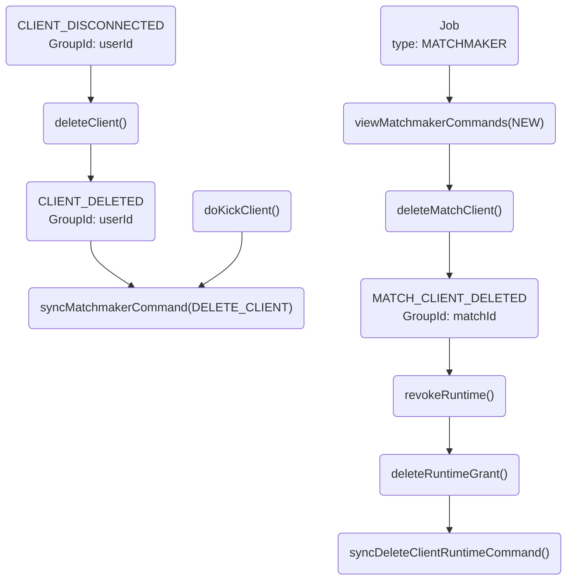

# Client Cleanup

```mermaid
graph TD;

ClientDisconnected(CLIENT_DISCONNECTED<br/>GroupId: userId) --> deleteClient("deleteClient()")
deleteClient("deleteClient()") --> ClientDeleted(CLIENT_DELETED<br/>GroupId: userId)
ClientDeleted(CLIENT_DELETED<br/>GroupId: userId) --> syncMatchmakerCommand("syncMatchmakerCommand(DELETE_CLIENT)")

MatchmakerJob(Job<br/>type: MATCHMAKER) --> viewMatchmakerCommands("viewMatchmakerCommands(NEW)")
viewMatchmakerCommands("viewMatchmakerCommands(NEW)") --> deleteMatchClient("deleteMatchClient()")
deleteMatchClient("deleteMatchClient()") --> MatchClientDeleted(MATCH_CLIENT_DELETED<br/>GroupId: matchId)
MatchClientDeleted(MATCH_CLIENT_DELETED<br/>GroupId: matchId) --> revokeRuntime("revokeRuntime()")
revokeRuntime("revokeRuntime()") --> deleteRuntimeGrant("deleteRuntimeGrant()")
deleteRuntimeGrant("deleteRuntimeGrant()") --> syncDeleteClientRuntimeCommand("syncDeleteClientRuntimeCommand()")

doKickClient("doKickClient()") --> syncMatchmakerCommand("syncMatchmakerCommand(DELETE_CLIENT)")

```

