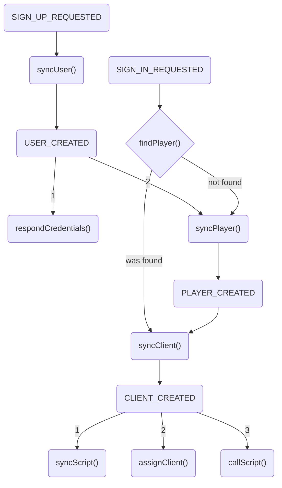

# SignIn/SignUp Event Graph

```mermaid
graph TD;

SignUpRequested(SIGN_UP_REQUESTED) --> syncUser("syncUser()")
syncUser("syncUser()") --> UserCreated(USER_CREATED)
UserCreated(USER_CREATED) -- 1 --> respondCredentials("respondCredentials()")
UserCreated(USER_CREATED) -- 2 --> syncPlayer("syncPlayer()")
SignInRequested(SIGN_IN_REQUESTED) --> findPlayer{"findPlayer()"}
findPlayer{"findPlayer()"} -- was found --> syncClient("syncClient()")
findPlayer{"findPlayer()"} -- not found --> syncPlayer("syncPlayer()")
syncPlayer("syncPlayer()") --> PlayerCreated(PLAYER_CREATED)
PlayerCreated(PLAYER_CREATED) --> syncClient("syncClient()")
syncClient("syncClient()") --> ClientCreated(CLIENT_CREATED)
ClientCreated(CLIENT_CREATED) -- 1 --> syncScript("syncScript()")
ClientCreated(CLIENT_CREATED) -- 2 --> assignClient("assignClient()")
ClientCreated(CLIENT_CREATED) -- 3 --> callScript("callScript()")
```
