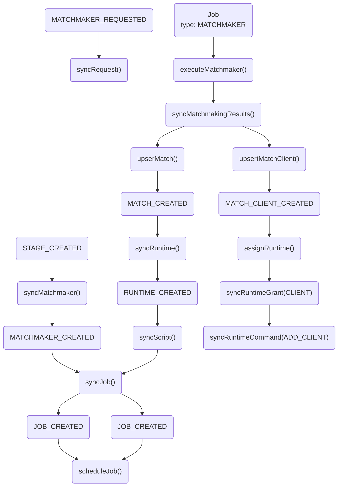

# Matchmaking Event Graph

```mermaid
graph TD;

StageCreated(STAGE_CREATED) --> syncMatchmaker("syncMatchmaker()")
syncMatchmaker("syncMatchmaker()") --> MatchmakerCreated(MATCHMAKER_CREATED)
MatchmakerCreated(MATCHMAKER_CREATED) --> syncJob("syncJob()")
syncJob("syncJob()") --> JobMatchmakerCreated(JOB_CREATED)
JobMatchmakerCreated(JOB_CREATED) --> scheduleJob("scheduleJob()")

MatchmakerRequested(MATCHMAKER_REQUESTED) --> syncRequest("syncRequest()")

MatchmakerJob(Job<br/>type: MATCHMAKER) --> executeMatchmaker("executeMatchmaker()")
executeMatchmaker("executeMatchmaker()") --> syncMatchmakingResults("syncMatchmakingResults()")

syncMatchmakingResults("syncMatchmakingResults()") --> upserMatch("upserMatch()")
upserMatch("upserMatch()") --> MatchCreated(MATCH_CREATED)
MatchCreated(MATCH_CREATED) --> syncRuntime("syncRuntime()")
syncRuntime("syncRuntime()") --> RuntimeCreated(RUNTIME_CREATED)
RuntimeCreated(RUNTIME_CREATED) --> syncScript("syncScript()")
syncJob("syncJob()") --> JobRuntimeCreated(JOB_CREATED)
JobRuntimeCreated(JOB_CREATED) --> scheduleJob("scheduleJob()")
syncScript("syncScript()") --> syncJob("syncJob()")

syncMatchmakingResults("syncMatchmakingResults()") --> upsertMatchClient("upsertMatchClient()")
upsertMatchClient("upsertMatchClient()") --> MatchClientCreated(MATCH_CLIENT_CREATED)
MatchClientCreated(MATCH_CLIENT_CREATED) --> assignRuntime("assignRuntime()")
assignRuntime("assignRuntime()") --> syncRuntimeGrant("syncRuntimeGrant(CLIENT)")
syncRuntimeGrant("syncRuntimeGrant(CLIENT)") --> syncRuntimeCommand("syncRuntimeCommand(ADD_CLIENT)")

```

