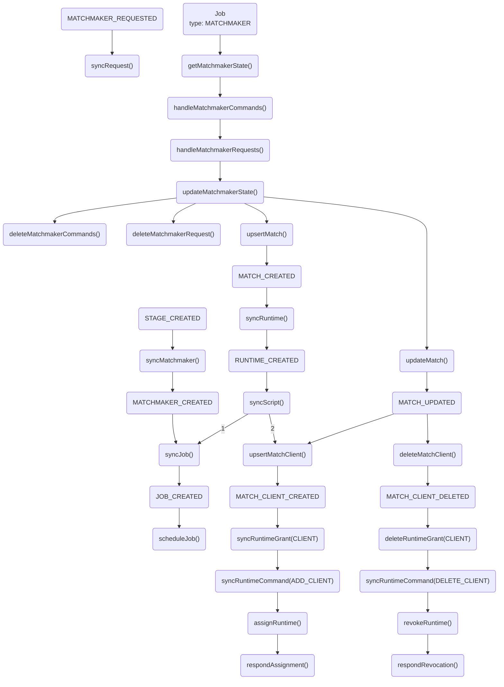

# Matchmaking Event Graph

```mermaid
graph TD;

StageCreated(STAGE_CREATED) --> syncMatchmaker("syncMatchmaker()")
syncMatchmaker("syncMatchmaker()") --> MatchmakerCreated(MATCHMAKER_CREATED)
MatchmakerCreated(MATCHMAKER_CREATED) --> syncJob("syncJob()")

MatchmakerRequested(MATCHMAKER_REQUESTED) --> syncRequest("syncRequest()")

MatchmakerJob(Job<br/>type: MATCHMAKER) --> getMatchmakerState("getMatchmakerState()")
getMatchmakerState("getMatchmakerState()") --> handleMatchmakerCommands("handleMatchmakerCommands()")
handleMatchmakerCommands("handleMatchmakerCommands()") --> handleMatchmakerRequests("handleMatchmakerRequests()")
handleMatchmakerRequests("handleMatchmakerRequests()") --> updateMatchmakerState("updateMatchmakerState()")

updateMatchmakerState("updateMatchmakerState()") --> deleteMatchmakerCommands("deleteMatchmakerCommands()")
updateMatchmakerState("updateMatchmakerState()") --> deleteMatchmakerRequest("deleteMatchmakerRequest()")

updateMatchmakerState("updateMatchmakerState()") --> upserMatch("upserMatch()")
upserMatch("upsertMatch()") --> MatchCreated(MATCH_CREATED)
MatchCreated(MATCH_CREATED) --> syncRuntime("syncRuntime()")
syncRuntime("syncRuntime()") --> RuntimeCreated(RUNTIME_CREATED)
RuntimeCreated(RUNTIME_CREATED) --> syncScript("syncScript()")
syncScript("syncScript()") -- 1 --> syncJob("syncJob()")
syncScript("syncScript()") -- 2 --> upsertMatchClient("upsertMatchClient()")
upsertMatchClient("upsertMatchClient()") --> MatchClientCreated(MATCH_CLIENT_CREATED)
MatchClientCreated(MATCH_CLIENT_CREATED) --> syncRuntimeGrant("syncRuntimeGrant(CLIENT)")
syncRuntimeGrant("syncRuntimeGrant(CLIENT)") --> syncAddClientRuntimeCommand("syncRuntimeCommand(ADD_CLIENT)")
syncAddClientRuntimeCommand("syncRuntimeCommand(ADD_CLIENT)") --> assignRuntime("assignRuntime()")
assignRuntime("assignRuntime()") --> respondAssignment("respondAssignment()")
respondAssignment("respondAssignment()")

updateMatchmakerState("updateMatchmakerState()") --> updateMatch("updateMatch()")
updateMatch("updateMatch()") --> MatchUpdated(MATCH_UPDATED)
MatchUpdated(MATCH_UPDATED) --> upsertMatchClient("upsertMatchClient()")
MatchUpdated(MATCH_UPDATED) --> deleteMatchClient("deleteMatchClient()")
deleteMatchClient("deleteMatchClient()") --> MatchClientDeleted(MATCH_CLIENT_DELETED)
MatchClientDeleted(MATCH_CLIENT_DELETED) --> deleteRuntimeGrant("deleteRuntimeGrant(CLIENT)")
deleteRuntimeGrant("deleteRuntimeGrant(CLIENT)") --> syncDeleteClientRuntimeCommand("syncRuntimeCommand(DELETE_CLIENT)")
syncDeleteClientRuntimeCommand("syncRuntimeCommand(DELETE_CLIENT)") --> revokeRuntime("revokeRuntime()")
revokeRuntime("revokeRuntime()") --> respondRevocation("respondRevocation()")

syncJob("syncJob()") --> JobCreated(JOB_CREATED)
JobCreated(JOB_CREATED) --> scheduleJob("scheduleJob()")

```

