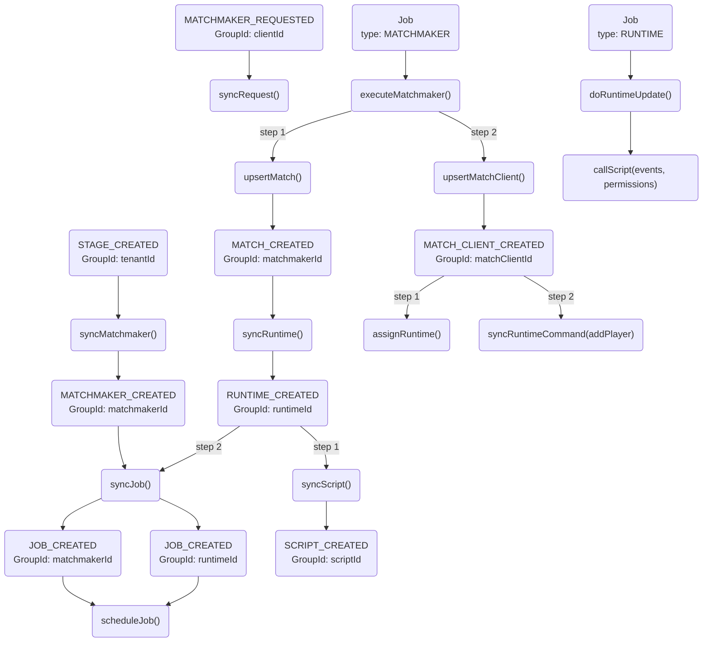

# Matchmaking Event Graph

```mermaid
graph TD;

StageCreated(STAGE_CREATED<br/>GroupId: tenantId) --> syncMatchmaker("syncMatchmaker()")
syncMatchmaker("syncMatchmaker()") --> MatchmakerCreated(MATCHMAKER_CREATED<br/>GroupId: matchmakerId)
MatchmakerCreated(MATCHMAKER_CREATED<br/>GroupId: matchmakerId) --> syncJob("syncJob()")
syncJob("syncJob()") --> JobMatchmakerCreated(JOB_CREATED<br/>GroupId: matchmakerId)
JobMatchmakerCreated(JOB_CREATED<br/>GroupId: matchmakerId) --> scheduleJob("scheduleJob()")

MatchmakerRequested(MATCHMAKER_REQUESTED<br/>GroupId: clientId) --> syncRequest("syncRequest()")

MatchmakerJob(Job<br/>type: MATCHMAKER) --> executeMatchmaker("executeMatchmaker()")
executeMatchmaker("executeMatchmaker()") -- step 1--> upsertMatch("upsertMatch()")
executeMatchmaker("executeMatchmaker()") -- step 2--> upsertMatchClient("upsertMatchClient()")

upsertMatch("upsertMatch()") --> MatchCreated(MATCH_CREATED<br/>GroupId: matchmakerId)
MatchCreated(MATCH_CREATED<br/>GroupId: matchmakerId) --> syncRuntime("syncRuntime()")
syncRuntime("syncRuntime()") --> RuntimeCreated(RUNTIME_CREATED<br/>GroupId: runtimeId)
RuntimeCreated(RUNTIME_CREATED<br/>GroupId: runtimeId) -- step 1 --> syncScript("syncScript()")
RuntimeCreated(RUNTIME_CREATED<br/>GroupId: runtimeId) -- step 2--> syncJob("syncJob()")
syncJob("syncJob()") --> JobRuntimeCreated(JOB_CREATED<br/>GroupId: runtimeId)
JobRuntimeCreated(JOB_CREATED<br/>GroupId: runtimeId) --> scheduleJob("scheduleJob()")
syncScript("syncScript()") --> ScriptCreated(SCRIPT_CREATED<br/>GroupId: scriptId)

upsertMatchClient("upsertMatchClient()") --> MatchClientCreated(MATCH_CLIENT_CREATED<br/>GroupId: matchClientId)
MatchClientCreated(MATCH_CLIENT_CREATED<br/>GroupId: matchClientId) -- step 1 --> assignRuntime("assignRuntime()")
MatchClientCreated(MATCH_CLIENT_CREATED<br/>GroupId: matchClientId) -- step 2 --> syncRuntimeCommand("syncRuntimeCommand(addPlayer)")

RuntimeJob(Job<br/>type: RUNTIME) --> doRuntimeUpdate("doRuntimeUpdate()")
doRuntimeUpdate("doRuntimeUpdate()") --> callScript("callScript(events, permissions)")

```

