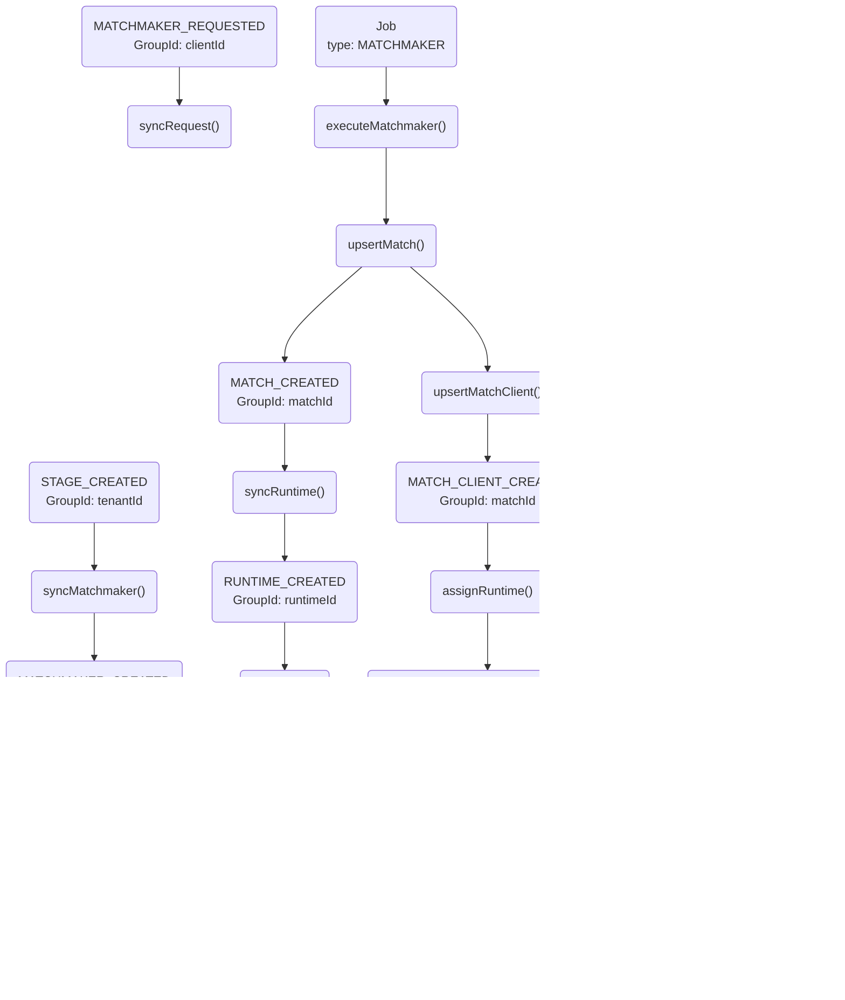

# Matchmaking Event Graph

```mermaid
graph TD;

StageCreated(STAGE_CREATED<br/>GroupId: tenantId) --> syncMatchmaker("syncMatchmaker()")
syncMatchmaker("syncMatchmaker()") --> MatchmakerCreated(MATCHMAKER_CREATED<br/>GroupId: matchmakerId)
MatchmakerCreated(MATCHMAKER_CREATED<br/>GroupId: matchmakerId) --> syncJob("syncJob()")
syncJob("syncJob()") --> JobMatchmakerCreated(JOB_CREATED<br/>GroupId: matchmakerId)
JobMatchmakerCreated(JOB_CREATED<br/>GroupId: matchmakerId) --> scheduleJob("scheduleJob()")

MatchmakerRequested(MATCHMAKER_REQUESTED<br/>GroupId: clientId) --> syncRequest("syncRequest()")

MatchmakerJob(Job<br/>type: MATCHMAKER) --> executeMatchmaker("executeMatchmaker()")
executeMatchmaker("executeMatchmaker()") --> upsertMatch("upsertMatch()")

upsertMatch("upsertMatch()") --> MatchCreated(MATCH_CREATED<br/>GroupId: matchId)
MatchCreated(MATCH_CREATED<br/>GroupId: matchId) --> syncRuntime("syncRuntime()")
syncRuntime("syncRuntime()") --> RuntimeCreated(RUNTIME_CREATED<br/>GroupId: runtimeId)
RuntimeCreated(RUNTIME_CREATED<br/>GroupId: runtimeId) --> syncScript("syncScript()")
syncJob("syncJob()") --> JobRuntimeCreated(JOB_CREATED<br/>GroupId: runtimeId)
JobRuntimeCreated(JOB_CREATED<br/>GroupId: runtimeId) --> scheduleJob("scheduleJob()")
syncScript("syncScript()") --> syncJob("syncJob()")

upsertMatch("upsertMatch()") --> upsertMatchClient("upsertMatchClient()")
upsertMatchClient("upsertMatchClient()") --> MatchClientCreated(MATCH_CLIENT_CREATED<br/>GroupId: matchId)
MatchClientCreated(MATCH_CLIENT_CREATED<br/>GroupId: matchId) --> assignRuntime("assignRuntime()")
assignRuntime("assignRuntime()") --> syncRuntimeGrant("syncRuntimeGrant(MANAGE_CLIENT)")
syncRuntimeGrant("syncRuntimeGrant(MANAGE_CLIENT)") --> syncRuntimeCommand("syncRuntimeCommand(ADD_PLAYER)")

RuntimeJob(Job<br/>type: RUNTIME) --> getRuntime("getRuntime()")
getRuntime("getRuntime()") --> checkRuntimeType{"type == Script"}
checkRuntimeType{"type == Script"} -- Yes --> viewRuntimeCommands("viewRuntimeCommands(NEW)")
viewRuntimeCommands("viewRuntimeCommands(NEW)") --> callScript("callScript()")
callScript("callScript()") --> markRuntimeCommands("markRuntimeCommands(PROCESSED)")

```

