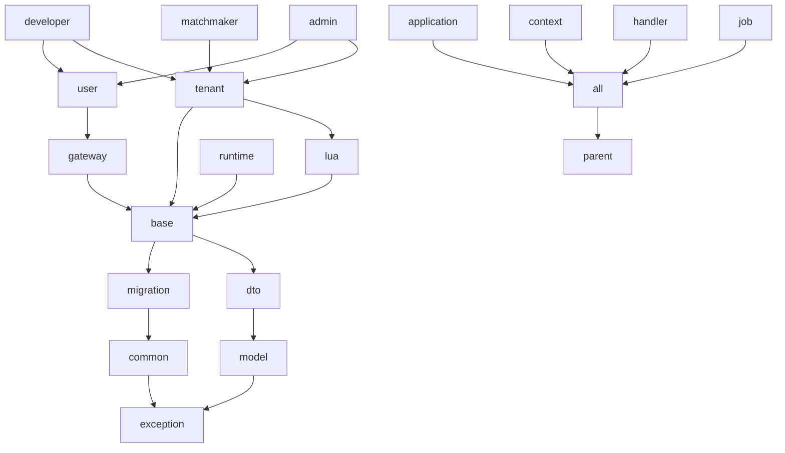

# Module relations schema for the project

```mermaid
graph TD;
model --> exception
dto --> model;
common --> exception;
migration --> common;
base --> migration;
base --> dto;
gateway --> base;
user --> gateway;
tenant --> base;
tenant --> lua;
lua --> base;
runtime --> base;
matchmaker --> tenant;
developer --> user;
developer --> tenant;
admin --> user;
admin --> tenant;
application --> all;
context --> all;
handler --> all;
job --> all;
all --> parent;
```