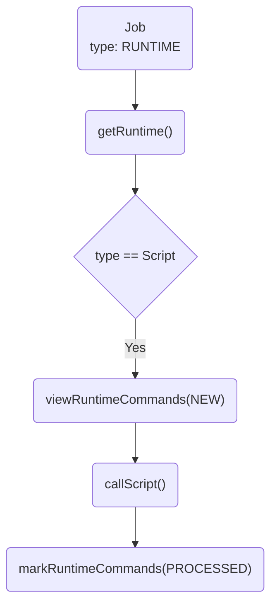

# Script Runtime Event Graph

```mermaid
graph TD;

RuntimeJob(Job<br/>type: RUNTIME) --> getRuntime("getRuntime()")
getRuntime("getRuntime()") --> checkRuntimeType{"type == Script"}
checkRuntimeType{"type == Script"} -- Yes --> viewRuntimeCommands("viewRuntimeCommands(NEW)")
viewRuntimeCommands("viewRuntimeCommands(NEW)") --> callScript("callScript()")
callScript("callScript()") --> markRuntimeCommands("markRuntimeCommands(PROCESSED)")

```

