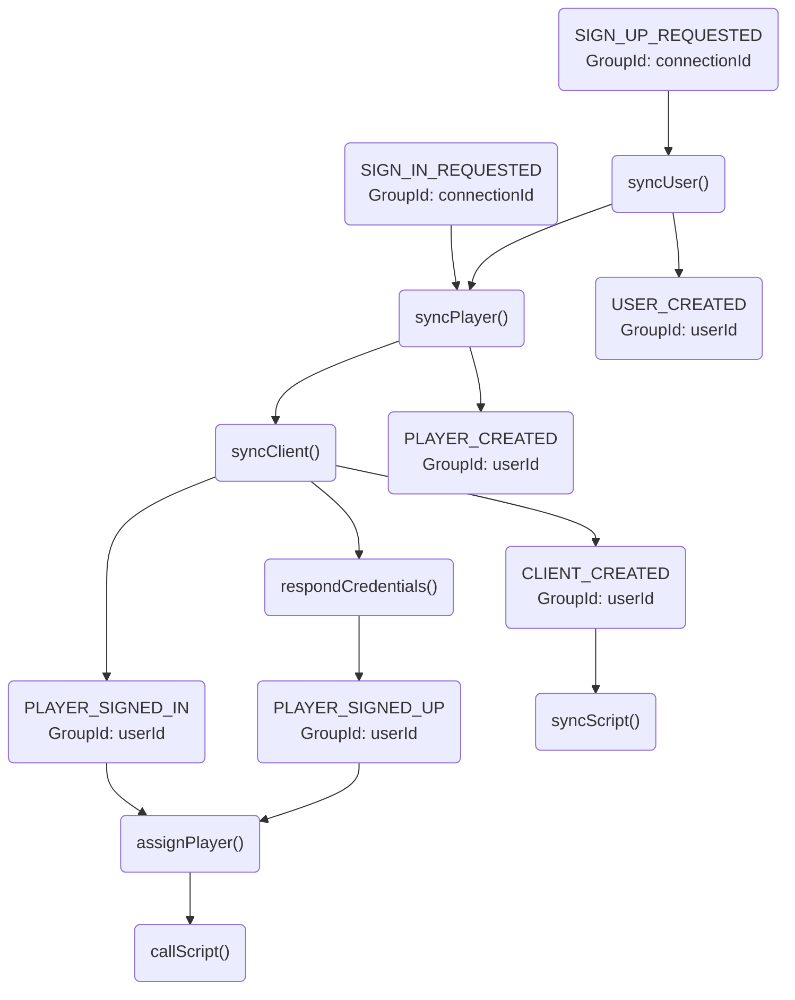

# SignIn/SignUp Event Graph

```mermaid
graph TD;

SignUpRequested(SIGN_UP_REQUESTED<br/>GroupId: connectionId) --> syncUser("syncUser()")
syncUser("syncUser()") --> syncPlayer("syncPlayer()")
syncPlayer("syncPlayer()") --> syncClient("syncClient()")
syncClient("syncClient()") --> respondCredentials("respondCredentials()")
respondCredentials("respondCredentials()") --> PlayerSignedUp(PLAYER_SIGNED_UP<br/>GroupId: userId)

SignInRequested(SIGN_IN_REQUESTED<br/>GroupId: connectionId) --> syncPlayer("syncPlayer()")
syncClient("syncClient()") --> PlayerSignedIn(PLAYER_SIGNED_IN<br/>GroupId: userId)

syncUser("syncUser()") --> UserCreated(USER_CREATED</br>GroupId: userId)
syncClient("syncClient()") --> ClientCreated(CLIENT_CREATED<br/>GroupId: userId)
syncPlayer("syncPlayer()") --> PlayerCreated(PLAYER_CREATED<br/>GroupId: userId)

ClientCreated(CLIENT_CREATED<br/>GroupId: userId) --> syncScript("syncScript()") 

PlayerSignedUp(PLAYER_SIGNED_UP<br/>GroupId: userId) --> assignPlayer("assignPlayer()")
PlayerSignedIn(PLAYER_SIGNED_IN<br/>GroupId: userId) --> assignPlayer("assignPlayer()")
assignPlayer("assignPlayer()") --> callScript("callScript()")
```

