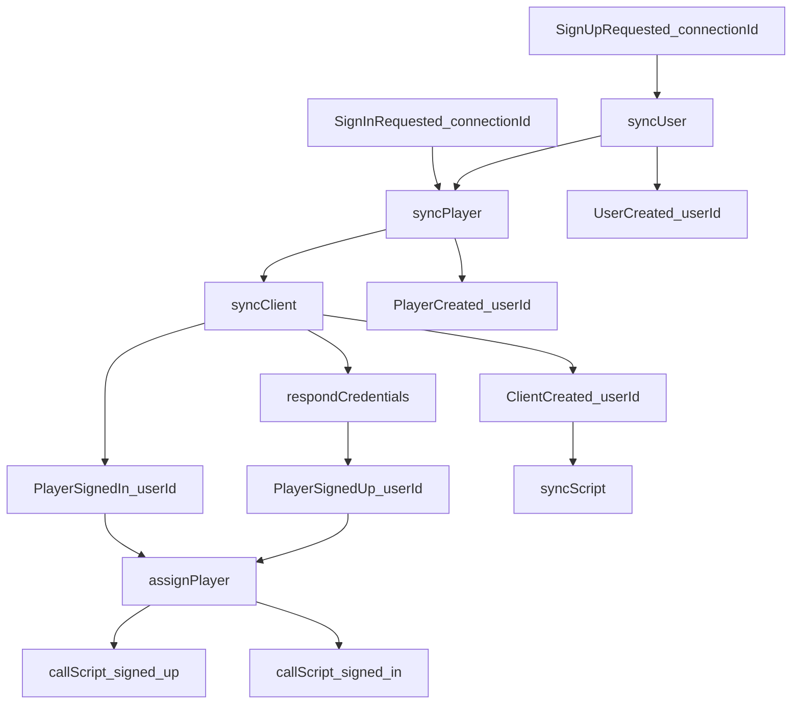

# SignIn/SignUp Event Graph

```mermaid
graph TD;

SignUpRequested_connectionId --> syncUser
syncUser --> syncPlayer
syncPlayer --> syncClient
syncClient --> respondCredentials
respondCredentials --> PlayerSignedUp_userId

SignInRequested_connectionId --> syncPlayer
syncClient --> PlayerSignedIn_userId

syncUser --> UserCreated_userId
syncClient --> ClientCreated_userId
syncPlayer --> PlayerCreated_userId

ClientCreated_userId --> syncScript 

PlayerSignedUp_userId --> assignPlayer
assignPlayer --> callScript_signed_up

PlayerSignedIn_userId --> assignPlayer
assignPlayer --> callScript_signed_in
```

