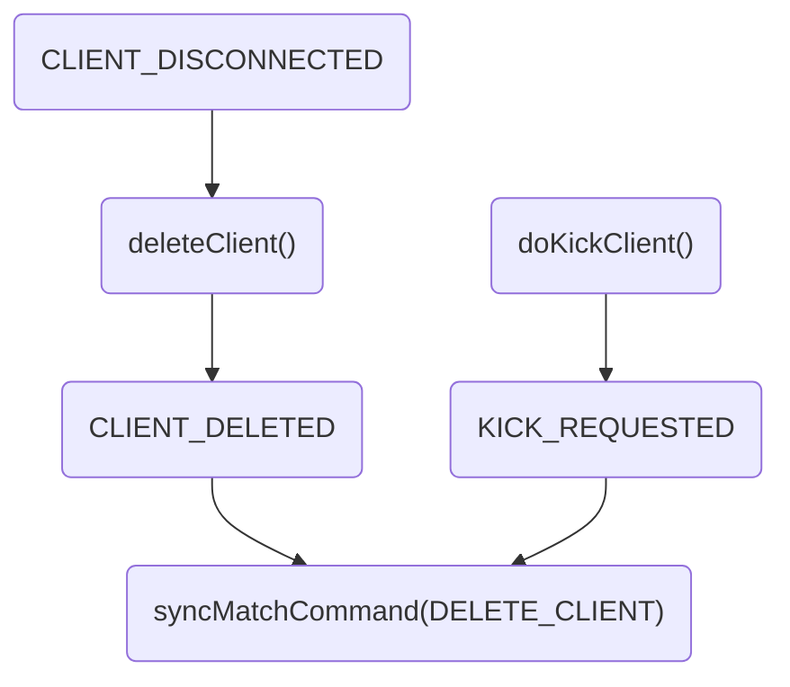

# Delete/Kick client

```mermaid
graph TD;

ClientDisconnected(CLIENT_DISCONNECTED) --> deleteClient("deleteClient()")
deleteClient("deleteClient()") --> ClientDeleted(CLIENT_DELETED)
ClientDeleted(CLIENT_DELETED) --> syncMatchCommand("syncMatchCommand(DELETE_CLIENT)")
doKickClient("doKickClient()") --> KickRequested(KICK_REQUESTED)
KickRequested(KICK_REQUESTED) --> syncMatchCommand("syncMatchCommand(DELETE_CLIENT)")

```

