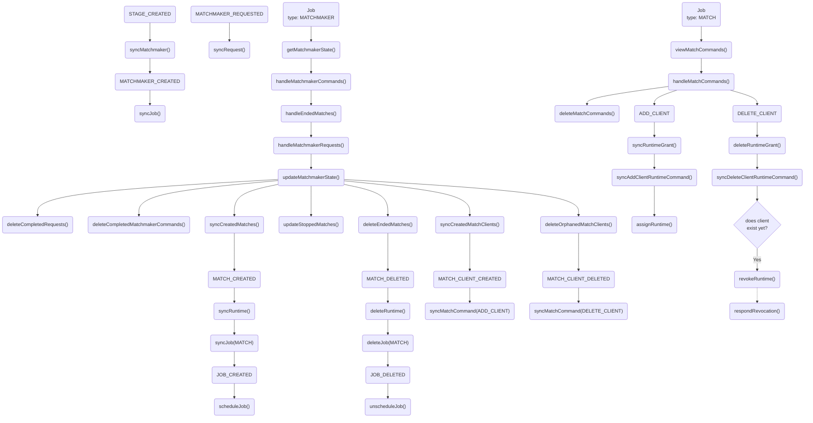

# Matchmaking schema

```mermaid
graph TD;

StageCreated(STAGE_CREATED) --> syncMatchmaker("syncMatchmaker()")
syncMatchmaker("syncMatchmaker()") --> MatchmakerCreated(MATCHMAKER_CREATED)
MatchmakerCreated(MATCHMAKER_CREATED) --> syncJob("syncJob()")

MatchmakerRequested(MATCHMAKER_REQUESTED) --> syncRequest("syncRequest()")

MatchmakerJob(Job<br/>type: MATCHMAKER) --> getMatchmakerState("getMatchmakerState()")
getMatchmakerState("getMatchmakerState()") --> handleMatchmakerCommands("handleMatchmakerCommands()")
handleMatchmakerCommands("handleMatchmakerCommands()") --> handleEndedMatches("handleEndedMatches()")
handleEndedMatches("handleEndedMatches()") --> handleMatchmakerRequests("handleMatchmakerRequests()")
handleMatchmakerRequests("handleMatchmakerRequests()") --> updateMatchmakerState("updateMatchmakerState()")

updateMatchmakerState("updateMatchmakerState()") --> deleteCompletedRequests("deleteCompletedRequests()")
updateMatchmakerState("updateMatchmakerState()") --> deleteCompletedMatchmakerCommands("deleteCompletedMatchmakerCommands()")
updateMatchmakerState("updateMatchmakerState()") --> syncCreatedMatches("syncCreatedMatches()")
updateMatchmakerState("updateMatchmakerState()") --> updateStoppedMatches("updateStoppedMatches()")
updateMatchmakerState("updateMatchmakerState()") --> deleteEndedMatches("deleteEndedMatches()")
updateMatchmakerState("updateMatchmakerState()") --> syncCreatedMatchClients("syncCreatedMatchClients()")
updateMatchmakerState("updateMatchmakerState()") --> deleteOrphanedMatchClients("deleteOrphanedMatchClients()")

syncCreatedMatches("syncCreatedMatches()") --> MatchCreated(MATCH_CREATED)
deleteEndedMatches("deleteEndedMatches()") --> MatchDeleted(MATCH_DELETED)
syncCreatedMatchClients("syncCreatedMatchClients()") --> MatchClientCreated(MATCH_CLIENT_CREATED)
deleteOrphanedMatchClients("deleteOrphanedMatchClients()") --> MatchClientDeleted(MATCH_CLIENT_DELETED)

MatchCreated(MATCH_CREATED) --> syncRuntime("syncRuntime()")
syncRuntime("syncRuntime()") --> syncMatchJob("syncJob(MATCH)")
syncMatchJob("syncJob(MATCH)") --> JobCreated(JOB_CREATED)

MatchDeleted(MATCH_DELETED) --> deleteRuntime("deleteRuntime()")
deleteRuntime("deleteRuntime()") --> deleteMatchJob("deleteJob(MATCH)")
deleteMatchJob("deleteJob(MATCH)") --> JobDeleted(JOB_DELETED)

MatchClientCreated(MATCH_CLIENT_CREATED) --> syncAddClientMatchCommand("syncMatchCommand(ADD_CLIENT)")
MatchClientDeleted(MATCH_CLIENT_DELETED) --> syncDeleteClientMatchCommand("syncMatchCommand(DELETE_CLIENT)")

JobCreated(JOB_CREATED) --> scheduleJob("scheduleJob()")
JobDeleted(JOB_DELETED) --> unscheduleJob("unscheduleJob()")


MatchJob(Job<br/>type: MATCH) --> viewMatchCommands("viewMatchCommands()")
viewMatchCommands("viewMatchCommands()") --> handleMatchCommands("handleMatchCommands()")
handleMatchCommands("handleMatchCommands()") --> deleteMatchCommands("deleteMatchCommands()")

handleMatchCommands("handleMatchCommands()") --> addClientCommand("ADD_CLIENT")
handleMatchCommands("handleMatchCommands()") --> deleteClientCommand("DELETE_CLIENT")

addClientCommand("ADD_CLIENT") --> syncRuntimeGrant("syncRuntimeGrant()")
syncRuntimeGrant("syncRuntimeGrant()") --> syncAddClientRuntimeCommand("syncAddClientRuntimeCommand()")
syncAddClientRuntimeCommand("syncAddClientRuntimeCommand()") --> assignRuntime("assignRuntime()")

deleteClientCommand("DELETE_CLIENT") --> deleteRuntimeGrant("deleteRuntimeGrant()")
deleteRuntimeGrant("deleteRuntimeGrant()") --> syncDeleteClientRuntimeCommand("syncDeleteClientRuntimeCommand()")
syncDeleteClientRuntimeCommand("syncDeleteClientRuntimeCommand()") --> checkClient{"does client</br>exist yet?"}
checkClient{"does client</br>exist yet?"} -- Yes --> revokeRuntime("revokeRuntime()")
revokeRuntime("revokeRuntime()") -.-> respondRevocation("respondRevocation()")

```

