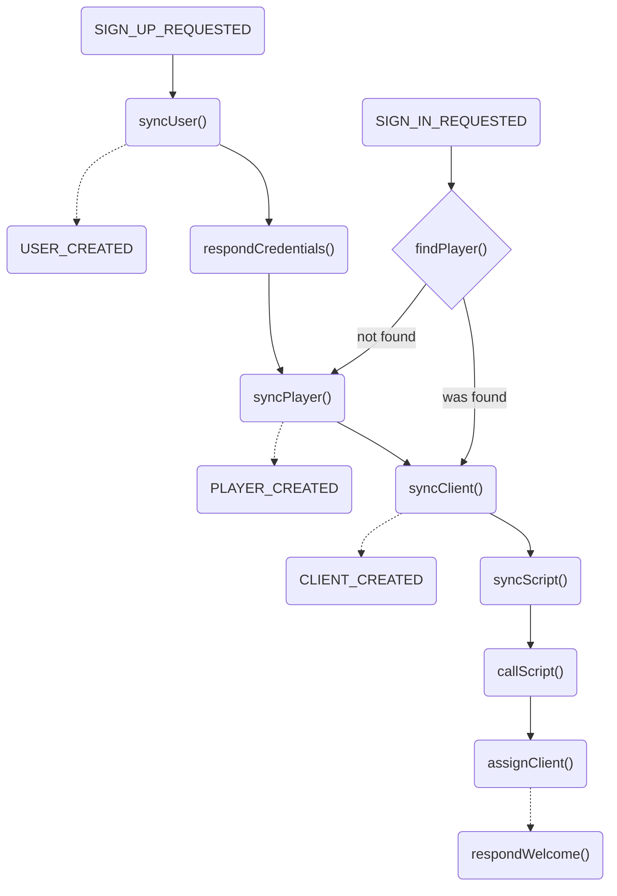

# SignIn/SignUp

```mermaid
graph TD;

SignUpRequested(SIGN_UP_REQUESTED) --> syncUser("syncUser()")
syncUser("syncUser()") -.-> UserCreated(USER_CREATED)
syncUser("syncUser()") --> respondCredentials("respondCredentials()")
respondCredentials("respondCredentials()") --> syncPlayer("syncPlayer()")
syncPlayer("syncPlayer()") -.-> PlayerCreated(PLAYER_CREATED)
syncPlayer("syncPlayer()") --> syncClient("syncClient()")
syncClient("syncClient()") -.-> ClientCreated(CLIENT_CREATED)
syncClient("syncClient()") --> syncScript("syncScript()")
syncScript("syncScript()") --> callScript("callScript()")
callScript("callScript()") --> assignClient("assignClient()") 
assignClient("assignClient()") -.-> respondWelcome("respondWelcome()") 

SignInRequested(SIGN_IN_REQUESTED) --> findPlayer{"findPlayer()"}
findPlayer{"findPlayer()"} -- was found --> syncClient("syncClient()")
findPlayer{"findPlayer()"} -- not found --> syncPlayer("syncPlayer()")
```
