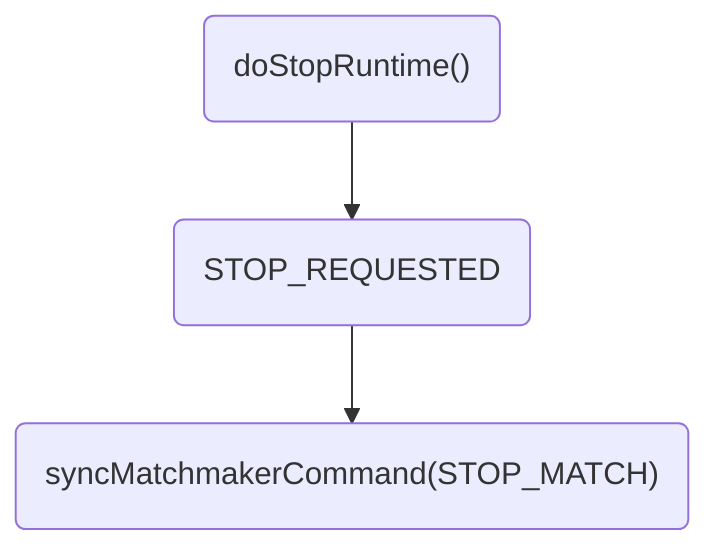

# Delete match

```mermaid
graph TD;

doStopRuntime("doStopRuntime()") --> StopRequested(STOP_REQUESTED)
StopRequested(STOP_REQUESTED) --> syncMatchmakerCommand("syncMatchmakerCommand(STOP_MATCH)")

```

